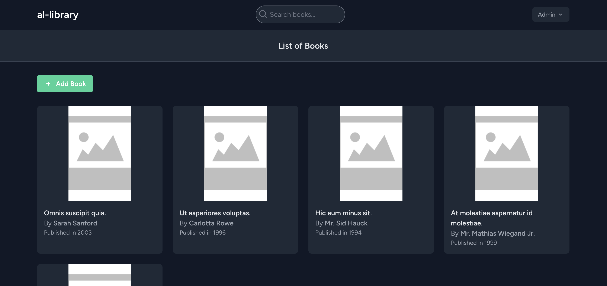

# al-library

al-library adalah proyek untuk mengelola data buku sederhana menggunakan Laravel 11. Proyek ini memiliki fitur-fitur berikut:

- **Support Dark Mode**: Tampilan yang mendukung mode gelap.
- **Tampilan yang Bagus**: Desain antarmuka yang menarik dan user-friendly.
- **Autentikasi**: login dan register.
- **Menggunakan Database SQLite**: Database yang ringan dan mudah digunakan, tidak perlu mengaktifkan service tersendiri.
- **Cocok Dijadikan Starter**: Ideal untuk dijadikan proyek awal.
- **Support Pagination**: Mendukung paginasi untuk navigasi data yang lebih mudah.

## Instalasi

Ikuti langkah-langkah berikut untuk menginstal proyek ini:

1. Clone repository ini ke lokal Anda:
    ```bash
    git clone https://github.com/username/al-library.git
    ```
2. Navigasi ke direktori proyek:
    ```bash
    cd al-library
    ```
3. Instal dependensi menggunakan Composer:
    ```bash
    composer install
    ```
4. Salin file `.env.example` menjadi `.env`:
    ```bash
    cp .env.example .env
    ```
5. Generate application key:
    ```bash
    php artisan key:generate
    ```
6. Jalankan migrasi database:
    ```bash
    php artisan migrate
    ```
7. Jalankan seeder untuk membuat data admin dan data buku otomatis:
    ```bash
    php artisan db:seed
    ```
    Seeder ini akan membuat akun admin dengan email `admin@example.com` dan password `password`, serta 5 data buku otomatis.

8. Jalankan server Laravel:
    ```bash
    php artisan serve
    ```
9. Buka browser dan akses `http://localhost:8000`.

## Penggunaan

1. Mulai dengan login atau daftar akun terlebih dahulu.
2. Setelah login, Anda akan diarahkan ke halaman dashboard.
3. Berikut adalah contoh tampilan halaman dashboard dengan data dari Seeder:



## Tahapan Pembuatan Proyek

Proyek ini dibuat dengan mengikuti tahapan-tahapan berikut:

1. **Membaca Kriteria yang Diminta**:
    - Memahami kebutuhan proyek dan fitur-fitur yang harus ada seperti bentuk data, autentikasi, CRUD buku, dsb.

2. **Desain Database Sederhana**:
    - Membuat skema database untuk tabel `books` dengan kolom seperti judul, penulis, penerbit, tahun terbit, dan deskripsi. Kemudian tambah untuk gambar juga agar terlihat lebih cantik.

3. **Inisialisasi Proyek Laravel**:
    - Install composer (baca dari https://laravel.com/docs/11.x/installation)
    - Install laravel menggunakan composer:
        ```bash
        composer global require laravel/installer
        ```
    - Menggunakan Laravel yang sudah di install global untuk membuat projek Laravel baru, pilih spesifikasi yang ingin digunakan seperti menggunakan starter kit breeze, database sqlite, dsb. :
        ```bash
        laravel new al-library
        ```
    - Mulai development dengan di lokal dengan masuk ke dalam directory projek tersebut dan jalankan server developmentnya:
        ```bash
        cd al-library
        npm install && npm run build
        composer run dev
        ```

4. **Implementasi Database yang Telah Di desain**:
    - Membuat migrasi untuk tabel `books`:
        ```bash
        php artisan make:migration create_books_table
        ```
    - Mengisi file migrasi dengan skema tabel `books` dan menjalankan migrasi:
        ```bash
        php artisan migrate
        ```

6. **Desain Controller Method untuk CRUD Buku**:
    - Membuat controller untuk buku:
        ```bash
        php artisan make:controller BookController
        ```
    - Menambahkan method untuk Create, Read, Update, dan Delete buku di `BookController`.

7. **Desain Proses Interaksi dari User/Admin**:
    - Membuat workflow untuk admin seperti melihat buku yang tersedia, mencari buku tertentu, menambahkan buku, mengedit buku, dan menghapus buku.
    - Mengatur halaman dan desain UI/UX yang sesuai dengan workflow tersebut, termasuk posisi tombol, warna, dsb.

8. **Ulangi Proses**:
    - Menguji aplikasi dan memperbaiki error atau desain yang belum sesuai.

9. **Tambahkan Support Dark Mode**:
    - Menggunakan tailwind untuk menambahkan mode gelap agar tampilan lebih keren.

Selamat menggunakan al-library!
